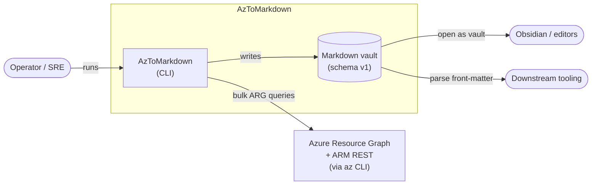
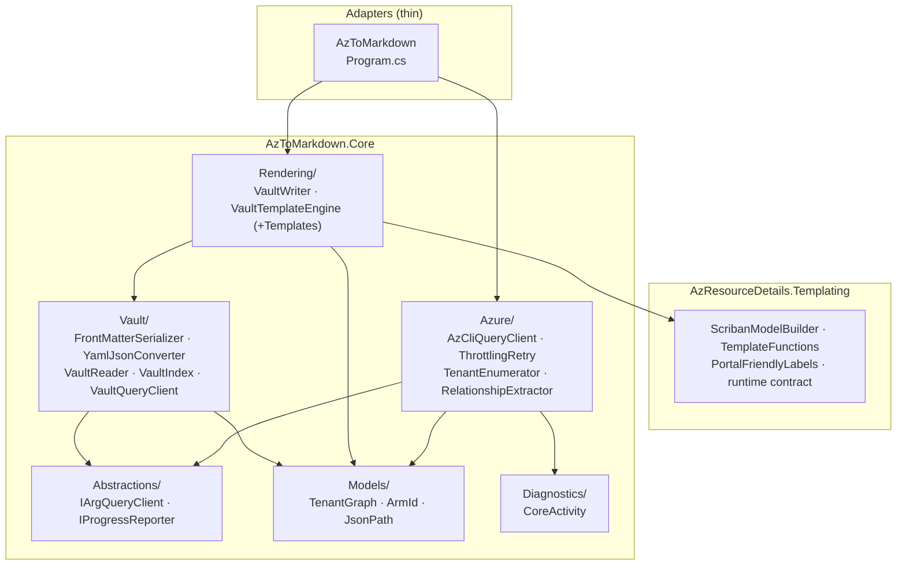
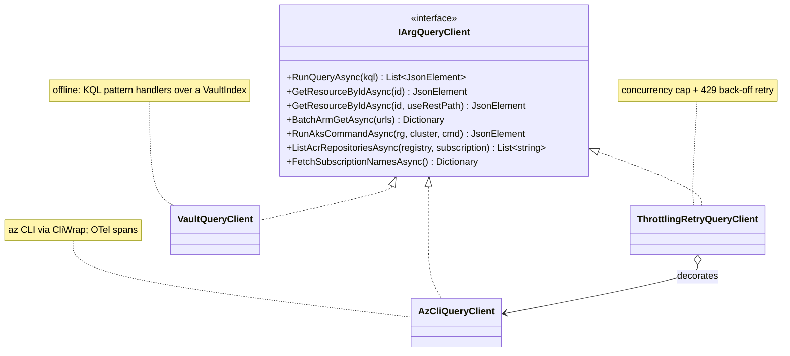
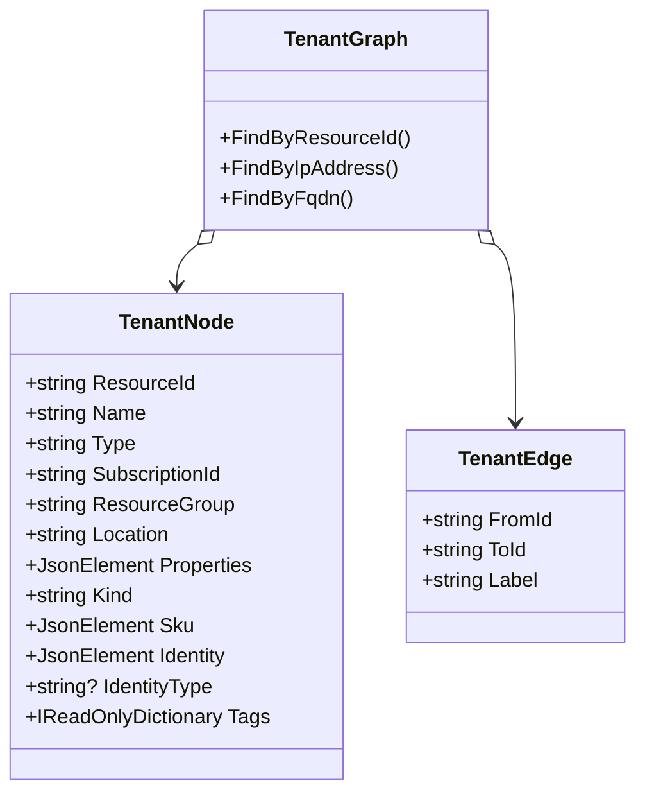
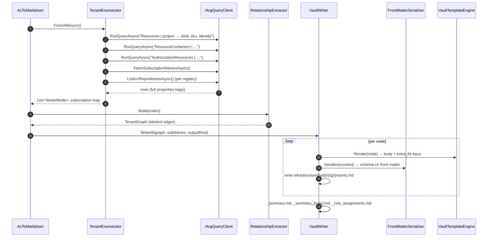
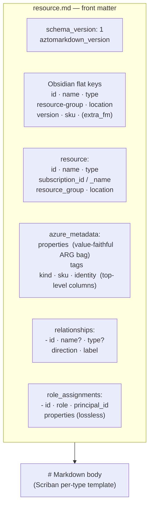
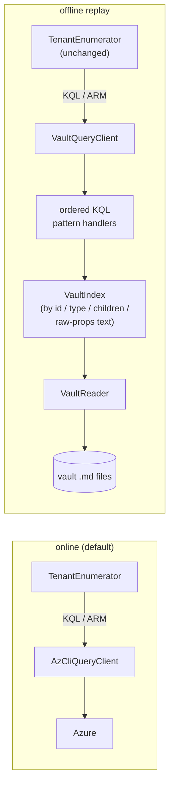
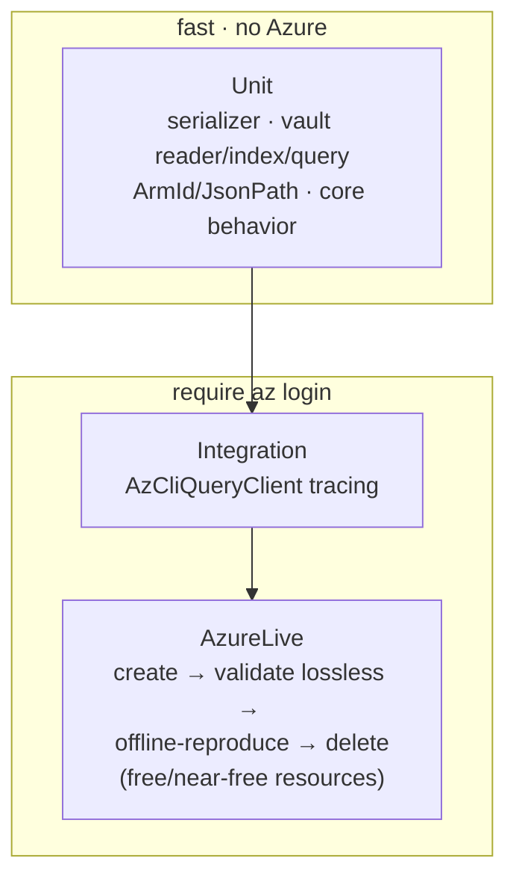

# AzToMarkdown — Technical Architecture

> **AzToMarkdown** is a .NET 10 CLI tool that reads an Azure tenant through Azure Resource Graph (ARG) and
> produces a **lossless, schema-versioned Markdown "vault"** — the durable *master data* for the
> whole tenant (one `.md` file per resource except role-assignment nodes, with complete projected
> Azure metadata in YAML front matter).
>
> It is built on a shared `AzToMarkdown.Core` library that does the
> enumeration, relationship extraction, and vault writing.

This document is the single technical reference for how the system is built. See the
[documentation index](README.md) for the metadata reference and contributor instructions.

---

## Table of contents

1. [System context](#1-system-context)
2. [Solution layout](#2-solution-layout)
3. [Component architecture](#3-component-architecture)
4. [Core abstractions — the seams](#4-core-abstractions--the-seams)
5. [The data model](#5-the-data-model)
6. [The pipeline — tenant → vault](#6-the-pipeline--tenant--vault)
7. [The vault schema v1 (master data)](#7-the-vault-schema-v1-master-data)
8. [Offline replay — the vault-backed query client](#8-offline-replay--the-vault-backed-query-client)
9. [Cross-cutting concerns](#9-cross-cutting-concerns)
10. [Testing strategy](#10-testing-strategy)
11. [Extension guide](#11-extension-guide)
12. [Key design decisions](#12-key-design-decisions)
13. [Operational runbook](#13-operational-runbook)

---

## 1. System context



**Key properties**

- **Authentication** is delegated entirely to the `az` CLI session (`az login`). No tokens are
  handled in-process.
- **Azure access** is funnelled through one seam ([`IArgQueryClient`](#4-core-abstractions--the-seams)),
  so the pipeline can be **replayed offline** from a vault by swapping that one implementation.
- The vault is the **source of truth** for the projected tenant snapshot: each resource retains its
  complete `properties` bag, tags, and top-level `kind`, `sku`, and `identity`, so supported offline
  consumers can operate without additional Azure calls.

---

## 2. Solution layout

```
AzToMarkdown.slnx                        VS solution
Directory.Packages.props                 Central versions for AzToMarkdown-owned projects

src/
  AzResourceDetails.Templating/          Synchronized portal-compatible Scriban runtime
  Libraries/
    AzToMarkdown.Core/                   ★ tenant graph and vault logic (see §3)
  Tools/
    AzToMarkdown/                             Vault CLI (thin wrapper over Core)
tests/
  AzResourceDetails.Templating.Tests/    Synchronized focused tests for the shared runtime
  AzToMarkdown.Tests/                    MSTest — serializer, vault, and core behavior unit tests
  AzToMarkdown.ScenarioTests/            MSTest — ARG integration + tracing + live
scripts/
  Sync-AzResourceDetailsTemplating.ps1   Copies/checks the sibling runtime and tests
docs/                                        this documentation set
```

All projects target **`net10.0`**. AzToMarkdown-owned projects use the versions pinned in
`Directory.Packages.props`; the byte-identical synchronized runtime and test projects retain the
package declarations from their authoritative repository.

---

## 3. Component architecture

Tenant and vault behavior lives in **`AzToMarkdown.Core`**; portal-compatible field bindings
and formatting functions live in the synchronized **`AzResourceDetails.Templating`** library.
The CLI is a thin adapter. Core is organized by namespace:



| Namespace | Responsibility |
|-----------|----------------|
| `Abstractions/` | The interfaces that decouple Core from Azure and progress reporting. |
| `Azure/` | Azure CLI transport and tenant enumeration, plus the pure in-memory relationship extractor. |
| `Models/` | Pure data: the tenant graph, and the shared `ArmId`/`JsonPath` helpers. |
| `Rendering/` | The vault writer and its Scriban template engine. |
| `Vault/` | The lossless YAML serialization, the vault reader, and the offline query client. |
| `Diagnostics/` | The `AzToMarkdown.Core` OTel `ActivitySource` (`CoreActivity`). |

---

## 4. Core abstractions — the seams

Two interfaces make the suite testable and offline-capable. The most important is
`IArgQueryClient`: **every** Azure call in the codebase goes through it.



| Interface | Live implementation | Offline / test implementation |
|-----------|--------------------|-------------------------------|
| `IArgQueryClient` | `ThrottlingRetryQueryClient` → `AzCliQueryClient` | `VaultQueryClient`, stub clients |
| `IProgressReporter` | `SpectreProgressReporter` (CLI) | `NullProgressReporter`, capturing reporter |

**The swap is the whole trick.** `AddAzToMarkdownCore()` registers the live stack; a caller
registers a replacement *after* it (DI last-registration-wins) to replay from a vault (for tests):

```csharp
services.AddAzToMarkdownCore(subscription);
services.AddSingleton<IArgQueryClient>(sp =>
    new VaultQueryClient(vaultPath, sp.GetRequiredService<IProgressReporter>()));
```

---

## 5. The data model



> `TenantNode.Type` is lowercased; `Properties` holds the full ARG bag; `Kind`, `Sku`, and
> `Identity` are top-level ARG columns (not inside `Properties`), and `IdentityType` exposes the
> managed-identity type when present. `TenantGraph` keeps bidirectional in/out
> indices for edge traversal and by-IP/by-FQDN lookups (used by `RelationshipExtractor` to resolve
> backend addresses and DNS record targets).

`TenantEnumerator` materializes nodes from the bulk ARG query; `RelationshipExtractor` builds the
labeled edges by parsing each node's already-fetched `Properties` JSON — no additional queries.
This is what gets written to the vault, and what `VaultReader` reconstructs.

Two shared helpers live in `Models/` and are the *single* home for this logic:

- **`JsonPath`** — case-insensitive `JsonElement` navigation (ARG property casing is unreliable),
  plus KQL `tostring()` semantics (`GetKqlString`).
- **`ArmId`** — ARM-id segment math (`StripSegments`, `SegmentAfter`, `ZoneName`).

---

## 6. The pipeline — tenant → vault



**Acquisition is cheap and lossless.** All resources in the visible subscriptions—or the requested
subscription—are fetched in 3 bulk ARG queries (plus one `az acr repository list` per registry,
since repos aren't in ARG). Each `TenantNode` carries the **complete** `properties` bag.

**Output layout** (resource files are deterministic; summary files record generation time):

```
vault/
  _summary.md                         schema_version + subscriptions map + type breakdown
  _summary_{type}.md                  per-type table (one per resource type)
  _role_assignments.md                subscription/RG-scoped role assignments (lossless)
  infrastructure/{sub}/{rg}/{name}.md one file per resource
  infrastructure/{sub}/{rg}/{acr}/repos/{repo}.md
  routes/{zone}.md                    DNS zones
  routes/{zone}/{recordType}/{name}.md
```

Front-matter is emitted by `FrontMatterSerializer` (YamlDotNet, never string concatenation); the
Scriban templates produce **only** the human-readable body plus a sentinel block of per-type flat
keys (`extra_fm`) that the writer folds into the front matter.

---

## 7. The vault schema v1 (master data)

Each resource file is a schema-versioned YAML front-matter document followed by a human-readable
body.



**Serialization rules** (lossless JSON ⇄ YAML — implemented by `YamlJsonConverter`):

| JSON | Emitted as | Round-trips because |
|------|-----------|---------------------|
| string | always **double-quoted** | quoted ⇒ string, verbatim |
| number | raw JSON text, **plain** scalar | preserves `1` vs `1.0` vs `1e5` |
| bool / null | plain scalar | unambiguous |
| empty object / array | `{}` / `[]` flow style | ⇒ empty container |

Always-quoting strings eliminates the YAML *norway problem* (`no`, `on`, `yes`), numeric-looking
strings (`"1.0"`, `"007"`), and special characters in one rule. On read, **quoted ⇒ string; plain ⇒
null/bool/number** — typing is unambiguous by construction.

**Design decisions baked into the schema**

- `azure_metadata.properties` stays **value-faithful** — friendly names are *not* injected into the
  raw bag (that would break value-parity). Names live only in `relationships[]`.
- `schema_version` gates compatibility: readers reject a *higher* version and skip files missing it.
- No timestamps in per-resource files → deterministic resource output. `_summary.md` and each
  `_summary_{type}.md` carry a `generated:` timestamp.
- Duplicate keys in ARM JSON (pathological, but legal) are suffix-disambiguated on write because
  YAML mappings cannot represent them directly — the one documented lossy corner.

**Schema evolution policy**: `schema_version` is bumped only for breaking structural changes;
additive keys are allowed within a version. Readers throw `NotSupportedException` on unsupported
higher versions and skip, with a warning, files missing `schema_version`.

**Example front-matter** (one resource):

```yaml
---
schema_version: 1
aztomarkdown_version: "2.1.0"
# ── Obsidian-friendly flat keys for the Properties panel ──
id: /subscriptions/00000000-0000-0000-0000-000000000000/resourceGroups/rg-x/providers/Microsoft.Network/networkInterfaces/my-nic
name: "my-nic"
type: Microsoft.Network/networkInterfaces
resource-group: rg-x
location: norwayeast
sku: "Standard_v2"            # example per-type extra key (from template extra_fm), safely re-quoted
# ── canonical machine-readable identity ──
resource:
  id: "/subscriptions/…/my-nic"
  name: "my-nic"
  type: "Microsoft.Network/networkInterfaces"
  subscription_id: "00000000-0000-0000-0000-000000000000"
  subscription_name: "My Subscription"
  resource_group: "rg-x"
  location: "norwayeast"
# ── lossless payload (value-faithful JSON→YAML of TenantNode.Properties) ──
azure_metadata:
  properties:
    ipConfigurations:
      - name: "ipconfig1"
        properties:
          privateIPAddress: "10.0.0.4"
          subnet:
            id: "/subscriptions/…/subnets/my-subnet"
  tags:
    environment: "Production"
  identity:                  # optional top-level ARM identity object
    type: "SystemAssigned"
    principalId: "00000000-0000-0000-0000-000000000001"
# ── normalized cross-resource references (from TenantGraph edges) ──
relationships:
  - id: "/subscriptions/…/subnets/my-subnet"
    name: "my-subnet"          # resolved from graph; key omitted when target unknown
    type: "Microsoft.Network/virtualNetworks/subnets"
    direction: outbound        # outbound | inbound
    label: "subnet"            # the TenantEdge label
# ── lossless embedded role assignments (assignments scoped to this resource) ──
role_assignments:
  - id: "/…/roleAssignments/<guid>"
    role: "Contributor"
    principal_id: "<guid>"
    properties: { …full lossless assignment properties bag… }
---
# my-nic
…human-readable Scriban body, unchanged…
```

**Vault-level files**, alongside the per-resource `.md` files:

- **`_summary.md`** — `schema_version: 1`, a `subscriptions:` map (`subscriptionId: displayName`,
  needed for offline `FetchSubscriptionNamesAsync`), and a `generated:` timestamp.
- **`_summary_{type}.md`** — one generated resource table per canonical type, with its own
  `generated:` timestamp plus type and count fields.
- **`_role_assignments.md`** — losslessly lists role assignments whose scope has no vault file of
  its own (subscription-scoped, RG-scoped, or an unknown target): `schema_version: 1` +
  `role_assignments:` in the same shape as above, plus a `scope:` field.

The active Azure inputs and relationship property paths are listed in
[metadata-reference.md](metadata-reference.md).

---

## 8. Offline replay — the vault-backed query client

Because Azure access is a single seam, an existing vault can be replayed through
`VaultQueryClient` with no `az` calls — proving the vault is genuinely lossless and giving a path
to offline testing/replay of `TenantEnumerator`-shaped queries.



**How it works.** Every ARG query `TenantEnumerator` issues is a *constant template with
interpolated parameters*. `VaultQueryClient` normalizes the query text and runs it through an
ordered list of `IKqlHandler` regex matchers, evaluating the equivalent lookup over an in-memory
`VaultIndex`. ARM `GET`/batch calls resolve to vault nodes or child-collections by id prefix.

- **Drift protection:** `VaultQueryClientTests` drive the *real* `TenantEnumerator` against the
  vault client, so a change to a production KQL constant breaks the build rather than silently
  breaking offline replay. `AzToMarkdownLiveVaultTests` (`AzureLive`) proves the same thing
  end-to-end against real Azure resources: write a vault from live data, then re-enumerate it
  through `VaultQueryClient` and assert the offline node set matches the live one.
- **Graceful degradation:** an unrecognized query returns empty + a warning.
- **Not supported offline:** `RunAksCommandAsync` (kubectl requires a live cluster) — not called by
  the AzToMarkdown pipeline in any case.

`VaultReader.ReadAll` reconstructs `TenantNode`s from the front matter (including `kind`/`sku`/`identity` and
role-assignment nodes); `VaultIndex` builds by-id, by-type, and parent→children lookups once at
load.

---

## 9. Cross-cutting concerns

### Throttling & concurrency

`ThrottlingRetryQueryClient` wraps the raw client with a **process-wide concurrency cap** and
**exponential-back-off retry** on ARG/ARM `RateLimiting` errors. The concurrency slot is released
*before* the back-off delay so a throttled query never blocks other queued work.

### Telemetry

Two `ActivitySource`s feed OpenTelemetry:

- **`AzToMarkdown.AzCli`** — one `Client` span per outbound `az` call (query, resource show,
  rest, batch, AKS invoke, ACR repository list, account list).
- **`AzToMarkdown.Core`** — `Internal` spans for retry/throttle events (`CoreActivity`).

### Dependency injection

`AddAzToMarkdownCore()` wires the whole stack. The **last-registration-wins** convention is the
extension point: register a replacement `IArgQueryClient` after it to change behavior (offline
replay, test stubs) without touching Core.

---

## 10. Testing strategy



| Category | Project | Needs | What it proves |
|----------|---------|-------|----------------|
| Runtime | AzResourceDetails.Templating.Tests | nothing | Shared model fields, friendly labels, functions, region data, and contract behavior. |
| `Unit` | Tests | nothing | Serializer round-trip/parity, vault read-back, offline query client vs. real `TenantEnumerator`, and helper correctness. |
| `Integration` | ScenarioTests | `az login` | Representative `AzCliQueryClient` calls emit correct OTel spans. |
| `AzureLive` | ScenarioTests | `az login` + write | Full **create → run AzToMarkdown → assert value-level lossless parity → offline-reproduce via `VaultQueryClient` → delete** cycle against real resources. |

`.github/workflows/ci.yml` builds the complete solution in Release mode and runs the full
`AzResourceDetails.Templating.Tests` and `AzToMarkdown.Tests` projects on both Ubuntu and Windows.
It intentionally does not run `Integration` or `AzureLive`: those categories require an authenticated
Azure CLI session, and the live suite also needs permission to create and delete a resource group.

Highlights:

- **Round-trip / consumer validation** — every property `RelationshipExtractor` consumes is proven
  retrievable from the YAML alone (`ConsumerPathValidationTests`), and `WriteAll → ReadAll` is
  value-faithful (`VaultRoundTripTests`).
- **KQL-drift protection** — offline handler tests (`VaultQueryClientTests`) run the real
  `TenantEnumerator` against `VaultQueryClient`.

Run the fast group (mandatory before claiming a change complete — see `AGENTS.md`). The live test
uses `westeurope` by default; set `AZTOMARKDOWN_LIVE_LOCATION` when subscription policy requires a
different region:

```bash
dotnet test tests/AzToMarkdown.Tests --filter "TestCategory=Unit"
```

---

## 11. Extension guide

### Add support for a new resource type in the vault
Nothing to do for storage — the bulk ARG query already captures the full bag for **every** type.
`VaultTemplateEngine` resolves a template in three tiers, in order: a hand-crafted template at
`Rendering/Templates/{provider}_{type}.sbn` (dots/slashes → underscores); failing that, a mirrored
template at `Rendering/PortalTemplates/{provider}_{type}.sbn` (see below); failing that,
`_generic.sbn`. Add a canonical-casing entry to `VaultTemplateEngine.NormaliseType` if desired.
Resource templates contain only their type-specific details: `VaultTemplateEngine` appends
`_common_footer.sbn` automatically so tags, role assignments, and future shared sections stay
consistent. To contribute per-type flat front-matter keys, a template optionally assigns a Scriban
global named `extra_fm` (e.g. `{{- extra_fm = "sku: \"" + model.props.sku + "\"" -}}`); the engine
reads that variable directly off the render context after rendering — no include or in-body marker
required — so a template that never touches `extra_fm` still renders correctly with no extra keys.

### Portal-fallback tier (`Rendering/PortalTemplates/`)
A one-way mirror of `AzResourceDetailsDownloader`'s `templates/` directory — mechanically-generated
Portal-Essentials-style property tables (one per resource type, built by matching Azure Portal field
labels against a captured example). They carry no relationships/wiki-link section and often contain
rows that legitimately fall back to "not available" because ARDL's single-resource-capture matching
can't resolve fields the Portal itself computes by joining across resources. `VaultTemplateEngine`
uses one only when no hand-crafted template exists for the type, via
`GetPortalTemplate`/`UsesPortalTemplate`. Never hand-edit files under this directory — the same
authoritative-source rule as the shared template runtime applies: fix quality issues upstream in
ARDL and re-sync with `scripts/Sync-PortalTemplates.ps1` (`-Check` to verify byte-for-byte parity),
or promote the type to a hand-crafted template under `Templates/` (which always wins) if it needs
vault-specific curation.

### Synchronize the shared template runtime

`scripts/Sync-AzResourceDetailsTemplating.ps1` copies the complete runtime project, its focused test
project, and `config/azure-locations.json` from the sibling `AzResourceDetailsDownloader`
repository. Those directories—including both `.csproj` files—and the region data are byte-identical
mirrors and must never be edited here. Make shared changes in the sibling repository, then run the
sync script; use `-Check` to detect drift without writing. The mirrored projects retain their own
package declarations while AzToMd-owned projects use central package management. AzToMd-specific
adapters outside the mirrored paths augment the shared `model.*` contract with relationships, role
assignments, tags, wiki links, and generic property summaries.

### Teach the graph a new relationship
Add a case to `RelationshipExtractor.ExtractNodeEdges` (or extend an existing per-type extractor
method). Read properties via `JsonPath` so casing is handled.

### Add an offline KQL handler
When you add a new constant KQL template to `TenantEnumerator`, add a matching `IKqlHandler` in
`Vault/VaultQueryClient.cs`'s handler list (regex over the normalized query text → `VaultIndex`
lookup). `VaultQueryClientTests`' drift test will fail until the handler exists.

### Evolve the schema
Add keys additively within `schema_version: 1`; bump to `2` only for a breaking change, and teach
`VaultReader` the new version. Readers already reject unknown higher versions.

---

## 12. Key design decisions

| # | Decision | Rationale |
|---|----------|-----------|
| 1 | Use **bulk ARG via az CLI** | Three queries acquire the complete `properties` bags, resource groups, and role assignments. Per-resource SDK GETs would add thousands of calls and increase throttling. |
| 2 | **Lossless YAML** with always-quoted strings + raw-text numbers | One rule kills the norway problem, numeric-string ambiguity, and special characters; typing on read is unambiguous. |
| 3 | Full metadata in **front matter** (not a sidecar) | Each rendered resource stays a single master-data unit; role assignments are embedded in scoped resources or the root assignment file. |
| 4 | `properties` stays **value-faithful**; names only in `relationships[]` | Preserves value parity and round-trip guarantees; avoids colliding with real ARM keys. |
| 5 | **Offline replay via one seam** (`IArgQueryClient`) | Lets `VaultQueryClient` stand in for live Azure without touching `TenantEnumerator`; drift-protected by tests driving the real query class. |
| 6 | **DI last-registration-wins** as the extension point | Offline-replay and test wiring need zero changes to Core. |
| 7 | Deterministic resource files; timestamps only in summaries | Resource-file diffs reflect Azure changes, while summary files record when the vault was generated. |

---

## 13. Operational runbook

**Prerequisites:** `az login` (with the `resource-graph` extension — auto-installed), .NET 10 SDK.

```bash
# PowerShell wrapper (builds the CLI when needed)
.\src\Tools\AzToMarkdown\AzToMarkdown.ps1 -Output .\vault -Subscription <sub-id>

# Or run directly through the .NET SDK
dotnet run --project src/Tools/AzToMarkdown -- --output ./vault --subscription <sub-id>
```

| Symptom | Cause / fix |
|---------|-------------|
| ARG `RateLimiting` errors | Handled automatically (concurrency cap + back-off); persistent 429s mean the quota window is saturated — reduce parallelism or wait. |
| Unknown-flag error from the CLI | The parser fails loudly on typos/missing values — check the flag. |

---

*Diagrams in this document are Mermaid and render on GitHub and in most Markdown viewers. See the
[`docs/`](README.md) index for the complete documentation set.*
