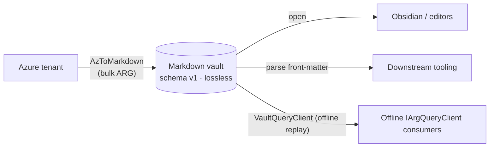

# AzToMarkdown documentation

AzToMarkdown reads an Azure tenant through Azure Resource Graph and produces a **lossless,
schema-versioned Markdown vault** (the master data). Start here to find the
right document.

## Read this first

| Document | What it covers | Read it when |
|----------|----------------|--------------|
| **[ARCHITECTURE.md](ARCHITECTURE.md)** | The full technical architecture — components, the tenant-to-vault pipeline, the data model, the offline query client, throttling/telemetry, testing, extension points, and design decisions. With diagrams. | You want to understand how the system is built or where to make a change. |
| [../AGENTS.md](../AGENTS.md) | Build/run/test commands, conventions, the mandatory test-run rules, and the vault schema summary. | You are about to build, run, or test — or make a change and need the guardrails. |

## The vault (master data)

| Document | What it covers |
|----------|----------------|
| [ARCHITECTURE.md §7](ARCHITECTURE.md#7-the-vault-schema-v1-master-data) | The normative schema v1 specification: the exact YAML front-matter layout and the lossless serialization rules. |
| [metadata-reference.md](metadata-reference.md) | The active Azure transport surface, tenant-enumeration queries, relationship property paths, and their vault representation. |

## Quick orientation

- **One seam.** All Azure access goes through `IArgQueryClient`. Online it is the `az` CLI;
  offline it can be replayed through `VaultQueryClient`, a vault-backed implementation of the same
  interface. See [ARCHITECTURE.md §4](ARCHITECTURE.md#4-core-abstractions--the-seams) and
  [§8](ARCHITECTURE.md#8-offline-replay--the-vault-backed-query-client).
- **Lossless by construction.** The vault stores every projected resource's complete `properties`
  bag plus tags and the top-level `kind`, `sku`, and `identity` fields. Serialization preserves JSON
  value kinds and raw numeric text across the JSON→YAML→JSON round trip. See
  [ARCHITECTURE.md §7](ARCHITECTURE.md#7-the-vault-schema-v1-master-data).
